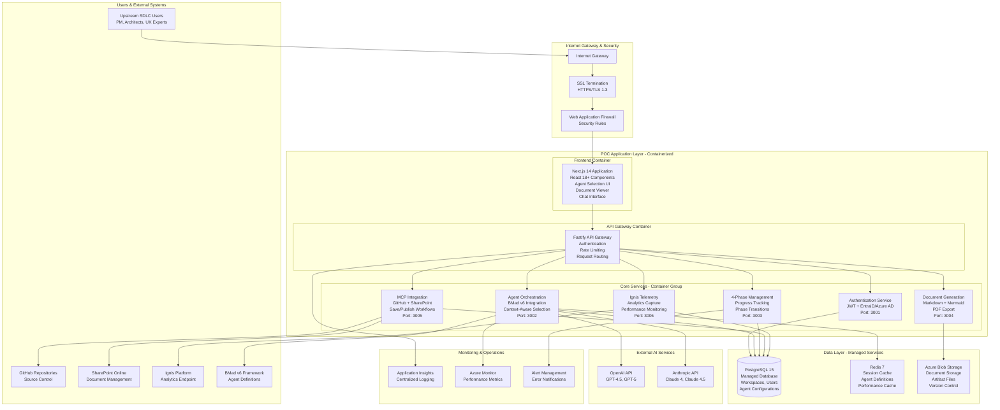

# BMad v6-Powered Platform - POC Architecture & Deployment Strategy

## Executive Summary

This document defines the technical architecture and deployment strategy for the BMad v6-Powered SDLC Platform Web UI POC. The architecture emphasizes **container-based deployment** with flexibility to deploy on Azure App Service initially and migrate to other cloud platforms as needed. The design supports rapid POC validation (4-6 weeks) while maintaining scalability for future production deployment.

## POC Architecture Overview

### Core Design Principles

1. **Container-First Architecture**: All services containerized for deployment flexibility
2. **Cloud-Agnostic Design**: Support for Azure App Service, AWS, GCP, or on-premises deployment
3. **Microservices Within Monorepo**: Focused services with shared libraries
4. **BMad v6 Integration**: Direct integration with BMad framework and agent orchestration
5. **Performance Optimized**: Sub-3-second response times with 5-10 concurrent users

### Technology Stack

**Frontend:**
- React 18+ with Next.js 14 (containerized)
- TypeScript, TailwindCSS, Mermaid.js
- WebSocket for real-time features

**Backend:**
- Node.js 20+ with Fastify
- Microservices architecture (containerized)
- JWT-based authentication

**Data Layer:**
- PostgreSQL 15 (managed service or containerized)
- Redis 7 for caching
- Object storage for documents

**External Integrations:**
- BMad v6 Framework
- High-end LLMs (GPT-4.5/5, Claude 4/4.5)
- GitHub API via MCP Server
- SharePoint API
- Ignis Platform

## POC System Architecture Diagram



## Container Architecture Details

### Container Design Strategy

**1. Frontend Container**
```dockerfile
# Next.js 14 Application Container
FROM node:20-alpine
WORKDIR /app
COPY package*.json ./
RUN npm ci --only=production
COPY . .
RUN npm run build
EXPOSE 3000
CMD ["npm", "start"]
```

**2. API Gateway Container**
```dockerfile
# Fastify API Gateway Container
FROM node:20-alpine
WORKDIR /app
COPY package*.json ./
RUN npm ci --only=production
COPY . .
EXPOSE 3000
CMD ["npm", "run", "start:gateway"]
```

**3. Microservices Containers**
- Each service (Auth, Agent, Workflow, Document, Integration, Telemetry) in separate containers
- Shared base image with common BMad v6 libraries
- Independent scaling and deployment capabilities

### Container Orchestration Options

**Option 1: Azure App Service (Recommended for POC)**
```yaml
# docker-compose.yml for local development
version: '3.8'
services:
  frontend:
    build: ./apps/frontend
    ports:
      - "3000:3000"
    environment:
      - API_URL=http://gateway:3000

  gateway:
    build: ./apps/gateway
    ports:
      - "3001:3000"
    depends_on:
      - postgres
      - redis

  auth-service:
    build: ./apps/auth
    ports:
      - "3002:3000"

  agent-service:
    build: ./apps/agent
    ports:
      - "3003:3000"

  postgres:
    image: postgres:15-alpine
    environment:
      - POSTGRES_DB=bmad_poc
      - POSTGRES_USER=bmad_user
      - POSTGRES_PASSWORD=${DB_PASSWORD}
    volumes:
      - postgres_data:/var/lib/postgresql/data

  redis:
    image: redis:7-alpine
    ports:
      - "6379:6379"

volumes:
  postgres_data:
```

## Deployment Strategy & Alternatives

### Primary Deployment Option: Azure App Service

**Advantages:**
- **Rapid POC Deployment**: Minimal infrastructure setup
- **Container Support**: Native Docker container deployment
- **Managed Services**: Built-in monitoring, scaling, SSL
- **Cost Effective**: Pay-as-you-use pricing for POC validation
- **BMad v6 Integration**: Full Node.js runtime support

**Architecture Pattern:**
```
Azure App Service (Frontend) →
Azure App Service (API Gateway) →
Multiple App Services (Microservices) →
Azure Database for PostgreSQL +
Azure Cache for Redis +
Azure Blob Storage
```

**POC Deployment Steps:**
1. **Container Registry**: Push containers to Azure Container Registry (ACR)
2. **App Services**: Deploy each service to separate App Service instances
3. **Database**: Provision Azure Database for PostgreSQL (Basic tier for POC)
4. **Cache**: Deploy Azure Cache for Redis (Basic tier)
5. **Storage**: Configure Azure Blob Storage for document management
6. **Monitoring**: Enable Application Insights for telemetry

### Alternative Deployment Options

**Option 2: Azure Container Instances (ACI)**
```yaml
# Azure Container Instances deployment
apiVersion: 2019-12-01
location: eastus
name: bmad-poc-container-group
properties:
  containers:
  - name: frontend
    properties:
      image: bmadregistry.azurecr.io/bmad-frontend:latest
      ports:
      - port: 3000
        protocol: TCP
      resources:
        requests:
          cpu: 1.0
          memoryInGB: 1.0
  - name: api-gateway
    properties:
      image: bmadregistry.azurecr.io/bmad-gateway:latest
      ports:
      - port: 3001
        protocol: TCP
      resources:
        requests:
          cpu: 1.0
          memoryInGB: 2.0
  osType: Linux
  restartPolicy: Always
type: Microsoft.ContainerInstance/containerGroups
```

**Advantages:**
- **Serverless Containers**: No VM management
- **Quick Scaling**: Fast startup times
- **Cost Efficient**: Pay per second usage
- **Simple Orchestration**: Minimal configuration

**Option 3: Azure Kubernetes Service (AKS)**
```yaml
# Kubernetes deployment manifest
apiVersion: apps/v1
kind: Deployment
metadata:
  name: bmad-frontend
spec:
  replicas: 2
  selector:
    matchLabels:
      app: bmad-frontend
  template:
    metadata:
      labels:
        app: bmad-frontend
    spec:
      containers:
      - name: frontend
        image: bmadregistry.azurecr.io/bmad-frontend:latest
        ports:
        - containerPort: 3000
        env:
        - name: API_URL
          value: "http://bmad-gateway-service:3000"
---
apiVersion: v1
kind: Service
metadata:
  name: bmad-frontend-service
spec:
  selector:
    app: bmad-frontend
  ports:
  - port: 80
    targetPort: 3000
  type: LoadBalancer
```

**Advantages:**
- **Production Ready**: Enterprise-grade orchestration
- **Advanced Features**: Auto-scaling, service mesh, monitoring
- **Multi-Cloud**: Can deploy to any Kubernetes cluster
- **Future Scalability**: Easy transition to production

### Cross-Cloud Deployment Alternatives

**AWS Alternative:**
- **Frontend**: AWS App Runner or ECS Fargate
- **Backend**: ECS with Fargate containers
- **Database**: Amazon RDS PostgreSQL
- **Cache**: Amazon ElastiCache Redis
- **Storage**: Amazon S3
- **Monitoring**: CloudWatch + X-Ray

**GCP Alternative:**
- **Frontend**: Google Cloud Run
- **Backend**: Cloud Run services
- **Database**: Cloud SQL PostgreSQL
- **Cache**: Memorystore Redis
- **Storage**: Cloud Storage
- **Monitoring**: Cloud Operations Suite

**On-Premises Alternative:**
- **Orchestration**: Docker Swarm or Kubernetes
- **Database**: Self-managed PostgreSQL cluster
- **Cache**: Self-managed Redis cluster
- **Storage**: Network-attached storage (NAS)
- **Monitoring**: Prometheus + Grafana

## Performance & Scalability Considerations

### POC Performance Targets

**Response Time Requirements:**
- BMad v6 web bundle loading: < 3 seconds
- Document generation: < 30 seconds
- Save operations: < 3 seconds
- Publish operations: < 5 seconds
- Page load times: < 2 seconds

**Concurrency Support:**
- Concurrent users: 5-10 during POC
- Simultaneous agent interactions: 20+
- Document operations: 50+ per minute

### Container Resource Allocation

**Frontend Container:**
- CPU: 0.5 vCPU
- Memory: 1 GB
- Storage: 2 GB

**API Gateway:**
- CPU: 1 vCPU
- Memory: 2 GB
- Storage: 1 GB

**Microservices (each):**
- CPU: 0.5-1 vCPU
- Memory: 1-2 GB
- Storage: 1 GB

**Database:**
- PostgreSQL: 2 vCPU, 4 GB RAM, 50 GB storage
- Redis: 1 vCPU, 2 GB RAM

### Auto-Scaling Strategy

**Horizontal Pod Autoscaler (for Kubernetes):**
```yaml
apiVersion: autoscaling/v2
kind: HorizontalPodAutoscaler
metadata:
  name: bmad-frontend-hpa
spec:
  scaleTargetRef:
    apiVersion: apps/v1
    kind: Deployment
    name: bmad-frontend
  minReplicas: 1
  maxReplicas: 5
  metrics:
  - type: Resource
    resource:
      name: cpu
      target:
        type: Utilization
        averageUtilization: 70
  - type: Resource
    resource:
      name: memory
      target:
        type: Utilization
        averageUtilization: 80
```

## Security & Compliance

### Container Security

**Base Image Security:**
- Use official, minimal base images (alpine variants)
- Regular security updates and vulnerability scanning
- Multi-stage builds to minimize attack surface
- Non-root user execution

**Runtime Security:**
```dockerfile
# Security-hardened container example
FROM node:20-alpine AS builder
WORKDIR /app
COPY package*.json ./
RUN npm ci --only=production

FROM node:20-alpine AS runtime
RUN addgroup -g 1001 -S nodejs
RUN adduser -S nextjs -u 1001
WORKDIR /app
COPY --from=builder --chown=nextjs:nodejs /app/node_modules ./node_modules
COPY --from=builder --chown=nextjs:nodejs /app .
USER nextjs
EXPOSE 3000
CMD ["npm", "start"]
```

**Network Security:**
- Internal service communication via private networks
- TLS encryption for all external communication
- API Gateway with rate limiting and DDoS protection
- Secrets management via Azure Key Vault or similar

### Data Security & Privacy

**Database Security:**
- Encrypted connections (SSL/TLS)
- Regular automated backups with encryption at rest
- Access control with minimal privilege principles
- Audit logging for compliance

**Document Storage:**
- Encrypted blob storage with access controls
- Version control with retention policies
- Integration with enterprise identity systems
- GDPR compliance for EU users

## Monitoring & Observability

### Application Performance Monitoring

**Metrics Collection:**
```javascript
// Example telemetry configuration
const telemetry = {
  serviceName: 'bmad-agent-service',
  serviceVersion: '1.0.0',
  metrics: {
    responseTime: 'histogram',
    requestCount: 'counter',
    errorRate: 'gauge',
    bmadAgentLoading: 'histogram',
    documentGeneration: 'histogram'
  },
  traces: {
    enabled: true,
    sampleRate: 1.0, // 100% sampling for POC
    exporters: ['jaeger', 'azureMonitor']
  }
}
```

**Health Checks:**
```yaml
# Kubernetes health check configuration
livenessProbe:
  httpGet:
    path: /health
    port: 3000
  initialDelaySeconds: 30
  periodSeconds: 10
readinessProbe:
  httpGet:
    path: /ready
    port: 3000
  initialDelaySeconds: 5
  periodSeconds: 5
```

### Log Aggregation

**Structured Logging:**
```javascript
// Standardized log format
const logger = {
  level: 'info',
  format: 'json',
  defaultMeta: {
    service: 'bmad-agent-service',
    version: '1.0.0',
    environment: 'poc'
  },
  transports: [
    new winston.transports.Console(),
    new winston.transports.File({ filename: 'app.log' }),
    new winston.transports.AzureApplicationInsights()
  ]
}
```

## Migration & Evolution Strategy

### POC to Production Evolution

**Phase 1: POC Validation (4-6 weeks)**
- Azure App Service deployment
- Basic monitoring and logging
- Single-region deployment
- Manual scaling

**Phase 2: MVP Enhancement (3-4 months)**
- Migrate to AKS or container orchestration
- Implement auto-scaling
- Add comprehensive monitoring
- Multi-region deployment

**Phase 3: Enterprise Production (6+ months)**
- Full Kubernetes deployment
- Advanced security features
- Disaster recovery
- Global CDN integration

### Container Migration Benefits

**Deployment Flexibility:**
- **Same containers** can be deployed to App Service, ACI, AKS, or any cloud
- **Infrastructure agnostic** - easy migration between providers
- **Development consistency** - identical environments across dev/test/prod
- **Rollback capabilities** - quick rollback to previous container versions

**Operational Benefits:**
- **Resource optimization** - precise resource allocation per service
- **Independent scaling** - scale services based on demand
- **Technology diversity** - different services can use optimal technology stacks
- **Team autonomy** - teams can independently deploy and manage their services

## Cost Optimization

### POC Cost Structure

**Azure App Service Deployment:**
- Frontend App Service: ~$20/month (Basic B1)
- API Gateway: ~$40/month (Standard S1)
- Microservices (6): ~$120/month (Basic B1 each)
- PostgreSQL: ~$50/month (Basic tier)
- Redis: ~$15/month (Basic tier)
- **Total Estimated Cost: ~$245/month**

**Alternative Cost Structures:**

**Azure Container Instances:**
- Estimated: ~$150/month (based on actual usage)
- Pay-per-second billing
- No minimum commitment

**Azure Kubernetes Service:**
- Estimated: ~$200/month (with reserved instances)
- Better resource utilization
- Advanced features included

### Cost Optimization Strategies

1. **Reserved Instances**: 30-60% savings for committed workloads
2. **Spot Instances**: Use for development and testing environments
3. **Auto-scaling**: Scale down during low usage periods
4. **Resource Right-sizing**: Monitor and adjust container resources
5. **Multi-tenant Services**: Combine low-traffic services in same container

## Conclusion & Recommendations

### Recommended POC Deployment Strategy

**Primary Recommendation: Azure App Service**
1. **Rapid deployment** capability for 4-6 week POC timeline
2. **Container-native** support with easy migration path
3. **Integrated monitoring** and security features
4. **Cost-effective** for POC validation phase
5. **Future flexibility** to migrate to AKS or other platforms

### Implementation Roadmap

**Week 1-2: Infrastructure Setup**
- Container registry setup
- Base container images
- Database provisioning
- CI/CD pipeline configuration

**Week 3-4: Service Deployment**
- Deploy core microservices
- Configure API Gateway
- Set up monitoring and logging

**Week 5-6: Integration & Testing**
- External API integrations
- Performance testing
- Security validation
- User acceptance testing

**Post-POC: Production Planning**
- Evaluate migration to AKS or alternative platforms
- Implement enterprise security features
- Plan multi-region deployment
- Optimize cost and performance

This architecture provides a **solid foundation** for POC validation while maintaining **flexibility for future evolution** through containerization and cloud-agnostic design principles. The container-based approach ensures that the same deployment artifacts can be used across different cloud providers and deployment models as the platform scales.