# BMad v6 POC - Container-Based Architecture Diagram

## POC Container Architecture Overview

This document provides detailed architecture diagrams for the BMad v6-Powered SDLC Platform POC with emphasis on container-based deployment strategies.

## Detailed POC System Architecture

```mermaid
graph TB
    subgraph "External Users & Services"
        PM[Product Managers<br/>Business Analysts]
        ARCH[Solution Architects<br/>Technical Architects]
        UX[UI/UX Experts<br/>Designers]
        DEVS[Development Teams<br/>BMad v6 IDE Users]

        GITHUB_API[GitHub API<br/>Repository Management]
        SP_API[SharePoint API<br/>Document Storage]
        IGNIS_API[Ignis Platform<br/>Analytics Endpoint]
        LLM_APIs[High-End LLMs<br/>GPT-4.5/5, Claude 4/4.5]
        BMAD_REPO[BMad v6 Framework<br/>Agent Definitions & Templates]
    end

    subgraph "Internet Gateway & Security Layer"
        INTERNET{Internet Gateway}
        WAF[Web Application Firewall<br/>DDoS Protection & Security Rules]
        SSL[SSL/TLS Termination<br/>Certificate Management]
        LB[Load Balancer<br/>Traffic Distribution]
    end

    subgraph "POC Container Platform - Azure App Service"

        subgraph "Frontend Container"
            FRONTEND["🌐 React/Next.js 14 Application<br/>📦 Container: bmad-frontend:latest<br/>🔧 Node.js 20 Runtime<br/>📊 Agent Selection Interface<br/>📝 Document Viewer & Editor<br/>💬 Chat Interface<br/>📈 Phase Progress Tracking<br/>⚡ Port: 3000"]
        end

        subgraph "API Gateway Container"
            GATEWAY["🚪 Fastify API Gateway<br/>📦 Container: bmad-gateway:latest<br/>🔐 Authentication & Authorization<br/>⏱️ Rate Limiting & Throttling<br/>🔄 Request Routing & Load Balancing<br/>📝 Request/Response Logging<br/>⚡ Port: 3000"]
        end

        subgraph "Core Microservices Container Group"
            AUTH["🔐 Authentication Service<br/>📦 Container: bmad-auth:latest<br/>🎫 JWT Token Management<br/>🏢 EntraID/Azure AD Integration<br/>👤 User Profile Management<br/>🔑 Session Handling<br/>⚡ Port: 3001"]

            AGENT["🤖 Agent Orchestration Service<br/>📦 Container: bmad-agent:latest<br/>🧠 BMad v6 Agent Selection<br/>🎯 Context-Aware Filtering<br/>📊 Dynamic Agent Loading<br/>🔄 Progressive Engagement<br/>🌐 High-End LLM Integration<br/>⚡ Port: 3002"]

            WORKFLOW["📋 4-Phase Workflow Service<br/>📦 Container: bmad-workflow:latest<br/>⚙️ Configuration Phase Management<br/>💡 Ideation Phase Orchestration<br/>📄 Product Definition Phase<br/>📅 Planning Phase Execution<br/>📊 Progress Tracking & Analytics<br/>⚡ Port: 3003"]

            DOCUMENT["📝 Document Generation Service<br/>📦 Container: bmad-document:latest<br/>📋 BMad v6 Template Processing<br/>🎨 Markdown & Mermaid Rendering<br/>📄 PDF Export Generation<br/>🔄 Version Control Management<br/>💾 Artifact Storage<br/>⚡ Port: 3004"]

            INTEGRATION["🔗 MCP Integration Service<br/>📦 Container: bmad-integration:latest<br/>📂 GitHub Repository Operations<br/>💾 Save to Working Branch<br/>🚀 Publish to Main Branch<br/>📊 Diff Visualization<br/>📁 SharePoint Document Sync<br/>⚡ Port: 3005"]

            TELEMETRY["📊 Ignis Telemetry Service<br/>📦 Container: bmad-telemetry:latest<br/>📈 Performance Metrics Capture<br/>👥 User Behavior Analytics<br/>🤖 Agent Utilization Tracking<br/>📡 Real-time Data Transmission<br/>🚨 Error & Alert Management<br/>⚡ Port: 3006"]
        end
    end

    subgraph "Managed Data Services - Azure"
        POSTGRES["🗄️ Azure Database for PostgreSQL 15<br/>📊 Workspaces & Project Data<br/>👥 User Management & Profiles<br/>🤖 Agent Configurations<br/>📋 Workflow State & Progress<br/>📄 Document Metadata<br/>🔒 Encrypted at Rest & Transit"]

        REDIS["⚡ Azure Cache for Redis 7<br/>🚀 Session & Authentication Cache<br/>🤖 Agent Definition Cache<br/>📊 Performance Optimization<br/>🔄 Real-time Data Cache<br/>⏱️ TTL-based Expiration"]

        BLOB["📁 Azure Blob Storage<br/>📄 Document File Storage<br/>🖼️ Generated Artifacts & PDFs<br/>📚 Version History Management<br/>🔒 Access Control & Encryption<br/>🌐 CDN Integration Ready"]
    end

    subgraph "Monitoring & Operations - Azure"
        INSIGHTS["📊 Application Insights<br/>📈 Performance Monitoring<br/>🚨 Real-time Alerting<br/>📋 Custom Dashboards<br/>🔍 Distributed Tracing<br/>📊 KPI Tracking"]

        MONITOR["📱 Azure Monitor<br/>🖥️ Infrastructure Metrics<br/>💾 Resource Utilization<br/>🔄 Auto-scaling Triggers<br/>📊 Cost Optimization<br/>🚨 Health Checks"]

        LOGS["📝 Log Analytics<br/>🔍 Centralized Log Aggregation<br/>🔎 Query & Search Capabilities<br/>📊 Log-based Metrics<br/>🚨 Alert Rules<br/>📈 Trend Analysis"]
    end

    %% User Connections
    PM --> INTERNET
    ARCH --> INTERNET
    UX --> INTERNET
    DEVS --> INTERNET

    %% Internet Gateway Flow
    INTERNET --> WAF
    WAF --> SSL
    SSL --> LB
    LB --> FRONTEND

    %% Frontend to Gateway
    FRONTEND --> GATEWAY

    %% Gateway to Microservices
    GATEWAY --> AUTH
    GATEWAY --> AGENT
    GATEWAY --> WORKFLOW
    GATEWAY --> DOCUMENT
    GATEWAY --> INTEGRATION
    GATEWAY --> TELEMETRY

    %% Microservices to Data Layer
    AUTH --> POSTGRES
    AUTH --> REDIS
    AGENT --> POSTGRES
    AGENT --> REDIS
    WORKFLOW --> POSTGRES
    DOCUMENT --> POSTGRES
    DOCUMENT --> BLOB
    INTEGRATION --> POSTGRES
    INTEGRATION --> BLOB
    TELEMETRY --> POSTGRES

    %% External API Integrations
    AGENT --> BMAD_REPO
    AGENT --> LLM_APIs
    INTEGRATION --> GITHUB_API
    INTEGRATION --> SP_API
    TELEMETRY --> IGNIS_API

    %% Monitoring Connections
    FRONTEND --> INSIGHTS
    GATEWAY --> INSIGHTS
    AUTH --> MONITOR
    AGENT --> MONITOR
    WORKFLOW --> LOGS
    DOCUMENT --> LOGS
    INTEGRATION --> INSIGHTS
    TELEMETRY --> MONITOR

    %% Styling
    classDef containerStyle fill:#E3F2FD,stroke:#1976D2,stroke-width:2px,color:#000
    classDef dataStyle fill:#F3E5F5,stroke:#7B1FA2,stroke-width:2px,color:#000
    classDef externalStyle fill:#E8F5E8,stroke:#388E3C,stroke-width:2px,color:#000
    classDef monitoringStyle fill:#FFF3E0,stroke:#F57C00,stroke-width:2px,color:#000

    class FRONTEND,GATEWAY,AUTH,AGENT,WORKFLOW,DOCUMENT,INTEGRATION,TELEMETRY containerStyle
    class POSTGRES,REDIS,BLOB dataStyle
    class GITHUB_API,SP_API,IGNIS_API,LLM_APIs,BMAD_REPO externalStyle
    class INSIGHTS,MONITOR,LOGS monitoringStyle
```



## Container Deployment Architecture

```mermaid
graph TB
    subgraph "Development Environment"
        DEV_LOCAL[Developer Workstation<br/>Docker Compose<br/>Local Testing]
        DEV_REGISTRY[Azure Container Registry<br/>bmadregistry.azurecr.io<br/>Image Storage & Versioning]
    end

    subgraph "CI/CD Pipeline - Azure DevOps"
        SOURCE[Source Code<br/>GitHub Repository<br/>Monorepo Structure]
        BUILD[Build Pipeline<br/>Docker Image Build<br/>Security Scanning<br/>Unit Testing]
        TEST[Test Pipeline<br/>Integration Testing<br/>Performance Testing<br/>Security Testing]
        DEPLOY[Deploy Pipeline<br/>Blue-Green Deployment<br/>Health Checks<br/>Rollback Capability]
    end

    subgraph "POC Production Environment - Azure"
        subgraph "Container Registry"
            ACR[Azure Container Registry<br/>Production Images<br/>Vulnerability Scanning<br/>Image Retention Policies]
        end

        subgraph "App Service Plan"
            APP_PLAN[Premium P1V3 Plan<br/>Auto-scaling Enabled<br/>4 vCore, 14GB RAM<br/>SSD Storage]
        end

        subgraph "Frontend App Services"
            FRONTEND_APP[BMad Frontend App Service<br/>Container: bmad-frontend:latest<br/>Custom Domain & SSL<br/>Auto-scaling Rules]
        end

        subgraph "Backend App Services"
            GATEWAY_APP[API Gateway App Service<br/>Container: bmad-gateway:latest<br/>Rate Limiting Enabled<br/>Health Monitoring]

            AUTH_APP[Auth Service App<br/>Container: bmad-auth:latest<br/>EntraID Integration<br/>JWT Management]

            AGENT_APP[Agent Service App<br/>Container: bmad-agent:latest<br/>BMad v6 Integration<br/>LLM Connectivity]

            WORKFLOW_APP[Workflow Service App<br/>Container: bmad-workflow:latest<br/>Phase Management<br/>Progress Tracking]

            DOCUMENT_APP[Document Service App<br/>Container: bmad-document:latest<br/>PDF Generation<br/>Template Processing]

            INTEGRATION_APP[Integration Service App<br/>Container: bmad-integration:latest<br/>GitHub MCP<br/>SharePoint Sync]

            TELEMETRY_APP[Telemetry Service App<br/>Container: bmad-telemetry:latest<br/>Metrics Collection<br/>Ignis Integration]
        end

        subgraph "Managed Data Services"
            POSTGRES_AZURE[Azure Database for PostgreSQL<br/>Flexible Server<br/>Burstable B1ms<br/>High Availability]

            REDIS_AZURE[Azure Cache for Redis<br/>Basic C1 (1GB)<br/>TLS Encryption<br/>Backup Enabled]

            STORAGE_AZURE[Azure Storage Account<br/>Blob Storage Hot Tier<br/>LRS Redundancy<br/>CDN Enabled]
        end

        subgraph "Networking & Security"
            VNET[Virtual Network<br/>Private Endpoints<br/>Network Security Groups<br/>Service Endpoints]

            KEY_VAULT[Azure Key Vault<br/>Secrets Management<br/>Connection Strings<br/>API Keys & Certificates]

            APP_GATEWAY[Application Gateway<br/>WAF Enabled<br/>SSL Termination<br/>Load Balancing]
        end

        subgraph "Monitoring Stack"
            APP_INSIGHTS[Application Insights<br/>APM & Diagnostics<br/>Custom Dashboards<br/>Alert Rules]

            LOG_ANALYTICS[Log Analytics Workspace<br/>Centralized Logging<br/>KQL Queries<br/>Retention Policies]

            AZURE_MONITOR[Azure Monitor<br/>Metrics & Alerts<br/>Auto-scaling Rules<br/>Cost Monitoring]
        end
    end

    %% Development Flow
    DEV_LOCAL --> SOURCE
    SOURCE --> BUILD
    BUILD --> DEV_REGISTRY
    DEV_REGISTRY --> TEST
    TEST --> DEPLOY
    DEPLOY --> ACR

    %% Deployment Flow
    ACR --> FRONTEND_APP
    ACR --> GATEWAY_APP
    ACR --> AUTH_APP
    ACR --> AGENT_APP
    ACR --> WORKFLOW_APP
    ACR --> DOCUMENT_APP
    ACR --> INTEGRATION_APP
    ACR --> TELEMETRY_APP

    %% App Service Dependencies
    FRONTEND_APP --> APP_PLAN
    GATEWAY_APP --> APP_PLAN
    AUTH_APP --> APP_PLAN
    AGENT_APP --> APP_PLAN
    WORKFLOW_APP --> APP_PLAN
    DOCUMENT_APP --> APP_PLAN
    INTEGRATION_APP --> APP_PLAN
    TELEMETRY_APP --> APP_PLAN

    %% Data Connections
    AUTH_APP --> POSTGRES_AZURE
    AUTH_APP --> REDIS_AZURE
    AGENT_APP --> POSTGRES_AZURE
    AGENT_APP --> REDIS_AZURE
    WORKFLOW_APP --> POSTGRES_AZURE
    DOCUMENT_APP --> STORAGE_AZURE
    INTEGRATION_APP --> STORAGE_AZURE
    TELEMETRY_APP --> POSTGRES_AZURE

    %% Security & Networking
    FRONTEND_APP --> VNET
    GATEWAY_APP --> KEY_VAULT
    AUTH_APP --> KEY_VAULT
    APP_GATEWAY --> FRONTEND_APP

    %% Monitoring
    FRONTEND_APP --> APP_INSIGHTS
    GATEWAY_APP --> APP_INSIGHTS
    AUTH_APP --> LOG_ANALYTICS
    AGENT_APP --> AZURE_MONITOR
    WORKFLOW_APP --> LOG_ANALYTICS
    DOCUMENT_APP --> APP_INSIGHTS
    INTEGRATION_APP --> LOG_ANALYTICS
    TELEMETRY_APP --> AZURE_MONITOR

    %% Styling
    classDef devStyle fill:#E8F5E8,stroke:#388E3C,stroke-width:2px
    classDef cicdStyle fill:#E3F2FD,stroke:#1976D2,stroke-width:2px
    classDef containerStyle fill:#FFF3E0,stroke:#F57C00,stroke-width:2px
    classDef appStyle fill:#F3E5F5,stroke:#7B1FA2,stroke-width:2px
    classDef dataStyle fill:#FFEBEE,stroke:#C62828,stroke-width:2px
    classDef securityStyle fill:#F1F8E9,stroke:#558B2F,stroke-width:2px
    classDef monitoringStyle fill:#E0F2F1,stroke:#00695C,stroke-width:2px

    class DEV_LOCAL,DEV_REGISTRY,SOURCE devStyle
    class BUILD,TEST,DEPLOY cicdStyle
    class ACR,APP_PLAN containerStyle
    class FRONTEND_APP,GATEWAY_APP,AUTH_APP,AGENT_APP,WORKFLOW_APP,DOCUMENT_APP,INTEGRATION_APP,TELEMETRY_APP appStyle
    class POSTGRES_AZURE,REDIS_AZURE,STORAGE_AZURE dataStyle
    class VNET,KEY_VAULT,APP_GATEWAY securityStyle
    class APP_INSIGHTS,LOG_ANALYTICS,AZURE_MONITOR monitoringStyle
```

## Alternative Deployment Architectures

### Option A: Azure Container Instances (Serverless)

```mermaid
graph TB
    subgraph "Serverless Container Deployment"
        subgraph "Container Groups"
            CG1[Frontend Container Group<br/>bmad-frontend:latest<br/>1 vCPU, 1.5GB RAM<br/>Auto-restart Policy]

            CG2[Backend Container Group<br/>Gateway + Auth + Agent<br/>2 vCPU, 4GB RAM<br/>Shared Network]

            CG3[Services Container Group<br/>Workflow + Document + Integration<br/>2 vCPU, 4GB RAM<br/>Shared Storage Mount]

            CG4[Telemetry Container Group<br/>bmad-telemetry:latest<br/>1 vCPU, 2GB RAM<br/>Dedicated Monitoring]
        end

        subgraph "Managed Services"
            ACI_DB[Azure Database for PostgreSQL<br/>Serverless Tier<br/>Auto-pause Enabled<br/>Backup Retention: 7 days]

            ACI_CACHE[Azure Cache for Redis<br/>Basic C0 (250MB)<br/>Cost-optimized<br/>No Persistence]

            ACI_STORAGE[Azure Files<br/>Premium SMB<br/>Shared Across Containers<br/>Backup Enabled]
        end
    end

    %% Connections
    CG1 --> CG2
    CG2 --> CG3
    CG3 --> CG4
    CG2 --> ACI_DB
    CG2 --> ACI_CACHE
    CG3 --> ACI_STORAGE
    CG4 --> ACI_DB

    classDef aciStyle fill:#E8EAF6,stroke:#3F51B5,stroke-width:2px
    classDef managedStyle fill:#F3E5F5,stroke:#7B1FA2,stroke-width:2px

    class CG1,CG2,CG3,CG4 aciStyle
    class ACI_DB,ACI_CACHE,ACI_STORAGE managedStyle
```

### Option B: Azure Kubernetes Service (Enterprise-Ready)


## Container Specifications & Resource Requirements

### Container Resource Allocation

| Container | CPU | Memory | Storage | Scaling |
|-----------|-----|--------|---------|---------|
| **Frontend** | 0.5-1 vCPU | 1-2 GB | 2 GB | 1-3 replicas |
| **API Gateway** | 1-2 vCPU | 2-4 GB | 1 GB | 1-2 replicas |
| **Auth Service** | 0.5 vCPU | 1 GB | 0.5 GB | 1-2 replicas |
| **Agent Service** | 1-2 vCPU | 2-4 GB | 1 GB | 1-3 replicas |
| **Workflow Service** | 0.5-1 vCPU | 1-2 GB | 1 GB | 1-2 replicas |
| **Document Service** | 1-2 vCPU | 2-4 GB | 2 GB | 1-3 replicas |
| **Integration Service** | 1 vCPU | 2 GB | 1 GB | 1-2 replicas |
| **Telemetry Service** | 0.5 vCPU | 1 GB | 0.5 GB | 1 replica |

### Performance Benchmarks

**Target Performance Metrics:**
- **Page Load Time**: < 2 seconds (React hydration)
- **Agent Loading**: < 3 seconds (BMad v6 bundle loading)
- **Document Generation**: < 30 seconds (standard artifacts)
- **Save Operation**: < 3 seconds (working branch)
- **Publish Operation**: < 5 seconds (merge to main)
- **Concurrent Users**: 5-10 (POC validation)
- **API Response Time**: < 500ms (95th percentile)

**Scalability Thresholds:**
- **CPU Utilization**: Scale up at 70% average
- **Memory Utilization**: Scale up at 80% average
- **Request Rate**: Scale up at 100 RPS per replica
- **Response Time**: Scale up if P95 > 1 second

## Security & Compliance Considerations

### Container Security Best Practices

**Image Security:**
```dockerfile
# Multi-stage build for minimal attack surface
FROM node:20-alpine AS builder
WORKDIR /app
COPY package*.json ./
RUN npm ci --only=production --ignore-scripts

# Runtime image with security hardening
FROM node:20-alpine AS runtime
RUN apk add --no-cache dumb-init && \
    addgroup -g 1001 -S nodejs && \
    adduser -S bmad -u 1001 -G nodejs

USER bmad
WORKDIR /app
COPY --from=builder --chown=bmad:nodejs /app/node_modules ./node_modules
COPY --chown=bmad:nodejs . .

EXPOSE 3000
ENTRYPOINT ["dumb-init", "--"]
CMD ["node", "server.js"]
```

**Runtime Security:**
- Non-root user execution
- Read-only file systems where possible
- Minimal base images (Alpine Linux)
- Regular security scanning
- Secrets management via Azure Key Vault

### Network Security

**Private Networking:**
```yaml
# Azure Virtual Network configuration
apiVersion: network.azure.com/v1
kind: VirtualNetwork
metadata:
  name: bmad-poc-vnet
spec:
  addressSpace:
    - 10.0.0.0/16
  subnets:
    - name: app-service-subnet
      addressPrefix: 10.0.1.0/24
      delegation: Microsoft.Web/serverFarms
    - name: data-subnet
      addressPrefix: 10.0.2.0/24
      serviceEndpoints:
        - Microsoft.Sql
        - Microsoft.Storage
```

**Traffic Encryption:**
- TLS 1.3 for all external communication
- mTLS for service-to-service communication
- Certificate rotation automation
- WAF with OWASP Top 10 protection

This comprehensive architecture provides a **robust, scalable, and secure foundation** for the BMad v6 POC while maintaining flexibility for future deployment options and evolution to enterprise-grade production systems.