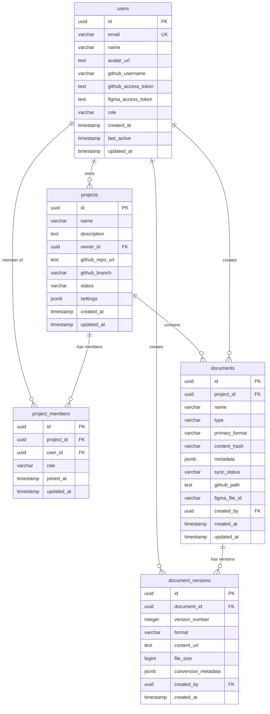

# Database Entity Relationship Diagram (ERD)

## Overview
This ERD represents the database schema for the BMAD Web Platform, a document management and collaboration system built on PostgreSQL with Supabase.

## Database Schema Visualization

## Table Descriptions

### users
- **Purpose**: Stores user accounts with authentication and integration credentials
- **Key Features**: 
  - GitHub and Figma OAuth integration
  - Role-based access control (admin, user, viewer)
  - Encrypted token storage

### projects  
- **Purpose**: Workspace containers for document collaboration
- **Key Features**:
  - GitHub repository integration
  - Flexible settings stored as JSONB
  - Status tracking (active, archived, draft)

### project_members
- **Purpose**: Many-to-many relationship between users and projects
- **Key Features**:
  - Role-based project access
  - Membership tracking and audit trail
  - *Note: Referenced in RLS policies but not explicitly defined in schema*

### documents
- **Purpose**: Core document entities supporting multiple formats
- **Key Features**:
  - Multi-format support (markdown, docx, xlsx, pdf, figma)
  - Content integrity via SHA-256 hashing
  - Sync status tracking for external integrations
  - Document type categorization

### document_versions
- **Purpose**: Version history and format-specific storage
- **Key Features**:
  - Format-specific versioning
  - File size tracking
  - Conversion metadata storage
  - Unique constraint on (document_id, version_number, format)

## Key Relationships

1. **User → Projects**: One-to-many ownership relationship
2. **User ↔ Projects**: Many-to-many membership via project_members
3. **Project → Documents**: One-to-many containment
4. **Document → Versions**: One-to-many versioning
5. **User → Documents/Versions**: Creation tracking

## Security Features

- **Row Level Security (RLS)** enabled on projects and documents
- **Multi-tenant access control** via RLS policies
- **Encrypted token storage** for OAuth credentials
- **Audit trails** with created_at/updated_at timestamps

## Indexes for Performance

- `idx_documents_project_id`: Fast project document lookups
- `idx_documents_type`: Document type filtering
- `idx_documents_sync_status`: Sync status queries
- `idx_document_versions_document_id`: Version history access

## Data Types & Constraints

- **UUIDs**: Primary keys for distributed system compatibility
- **JSONB**: Flexible metadata and settings storage
- **CHECK constraints**: Data validation (roles, statuses, formats)
- **Foreign key constraints**: Referential integrity
- **Unique constraints**: Data consistency (email, version combinations)
