# BMad v6-Powered SDLC Platform - POC Architecture Document

## Executive Summary

This document defines the complete technical architecture for the **BMad v6-Powered SDLC Platform Web UI Proof of Concept (POC)**. The architecture demonstrates an intelligent web-based platform that democratizes BMad v6's proven AI-driven agile methodology for upstream SDLC activities (ideation, planning, solutioning) through container-based deployment with Azure App Service as the primary deployment target and multi-cloud alternatives for production scalability.

The POC validates core concepts including intelligent agent orchestration, context-aware BMad v6 integration, dual-action GitHub workflows, and comprehensive artifact generation while maintaining seamless integration with existing BMad v6 IDE workflows for downstream development. The architecture emphasizes deployment flexibility through containerization, supporting migration from Azure App Service to AKS, ACI, AWS, GCP, or on-premises infrastructure as requirements evolve.

## Related Documentation

- **[POC Brief](./poc-brief.md)** - Project scope, objectives, and success criteria
- **[POC PRD](./poc-prd.md)** - Comprehensive requirements and user stories
- **[Complete Project Architecture](./architecture.md)** - Full platform architecture for post-POC development
- **[POC Deployment Strategy](../POC_ARCHITECTURE_DEPLOYMENT_STRATEGY.md)** - Detailed deployment options and strategies
- **[Container Architecture Diagrams](../POC_CONTAINER_ARCHITECTURE_DIAGRAMS.md)** - Visual architecture diagrams with container specifications

## POC Architecture Overview

### Design Principles

1. **Container-First Architecture**: All services containerized for maximum deployment flexibility
2. **Cloud-Agnostic Design**: Primary Azure deployment with seamless migration paths to AWS, GCP, or on-premises
3. **BMad v6 Methodology Preservation**: Maintains framework integrity while democratizing access through web interfaces
4. **Intelligent Simplicity**: Complex AI-driven capabilities presented through intuitive, context-aware interfaces
5. **Performance Optimized**: Sub-3-second response times with 5-10 concurrent users for POC validation
6. **Microservices Within Monorepo**: Focused services with shared libraries for rapid development and coordinated deployment

### Technology Stack

**Frontend Layer:**
- **Framework**: React 18+ with Next.js 14 (containerized)
- **Languages**: TypeScript, CSS (TailwindCSS)
- **Visualization**: Mermaid.js for diagrams
- **Real-time**: WebSocket for live features

**Backend Layer:**
- **Runtime**: Node.js 20+ with Fastify framework
- **Architecture**: Microservices (containerized)
- **Authentication**: JWT-based with EntraID/Azure AD SSO
- **API Design**: RESTful with OpenAPI specifications

**Data Layer:**
- **Primary Database**: PostgreSQL 15 (managed service or containerized)
- **Cache Layer**: Redis 7 for session management and performance optimization
- **File Storage**: Azure Blob Storage for document and artifact management

**External Integrations:**
- **BMad Framework**: Direct v6 framework integration with agent orchestration
- **AI Services**: High-end LLMs (GPT-4.5/5, Claude 4/4.5) for extensive context processing
- **Repository Management**: GitHub API via dedicated MCP Server
- **Document Management**: SharePoint API for enterprise integration
- **Analytics Platform**: Ignis Platform for comprehensive telemetry

## System Architecture Diagram

```mermaid
graph TB
    subgraph "Users & External Systems"
        USERS[Upstream SDLC Users<br/>PM, Architects, UX Experts]
        GITHUB_EXT[GitHub Repositories<br/>Source Control & Documentation]
        SHAREPOINT_EXT[SharePoint Online<br/>Enterprise Document Management]
        IGNIS_EXT[Ignis Platform<br/>Analytics & Telemetry Endpoint]
        BMAD_FRAMEWORK[BMad v6 Framework<br/>Agent Definitions & Templates]
    end

    subgraph "Internet Gateway & Security"
        INTERNET[Internet Gateway]
        SSL[SSL Termination<br/>HTTPS/TLS 1.3]
        FIREWALL[Web Application Firewall<br/>Security Rules & DDoS Protection]
        LB[Load Balancer<br/>Traffic Distribution]
    end

    subgraph "POC Application Layer - Container Platform"
        subgraph "Frontend Container"
            NEXTJS[Next.js 14 Application<br/>📦 Container: bmad-frontend:latest<br/>🔧 React 18+ Components<br/>🤖 Agent Selection Interface<br/>📝 Document Viewer & Editor<br/>💬 Chat Interface<br/>📊 Phase Progress Tracking<br/>⚡ Port: 3000]
        end

        subgraph "API Gateway Container"
            GATEWAY[Fastify API Gateway<br/>📦 Container: bmad-gateway:latest<br/>🔐 Authentication & Authorization<br/>⏱️ Rate Limiting & Throttling<br/>🔄 Request Routing & Load Balancing<br/>📝 Comprehensive Logging<br/>⚡ Port: 3000]
        end

        subgraph "Core Microservices Container Group"
            AUTH[🔐 Authentication Service<br/>📦 Container: bmad-auth:latest<br/>🎫 JWT Token Management<br/>🏢 EntraID/Azure AD Integration<br/>👤 User Profile Management<br/>⚡ Port: 3001]

            AGENT[🤖 Agent Orchestration Service<br/>📦 Container: bmad-agent:latest<br/>🧠 BMad v6 Agent Selection<br/>🎯 Context-Aware Filtering<br/>📊 Dynamic Agent Loading<br/>🔄 Progressive Engagement<br/>🌐 High-End LLM Integration<br/>⚡ Port: 3002]

            WORKFLOW[📋 4-Phase Workflow Service<br/>📦 Container: bmad-workflow:latest<br/>⚙️ Configuration Phase Management<br/>💡 Ideation Phase Orchestration<br/>📄 Product Definition Phase<br/>📅 Planning Phase Execution<br/>📊 Progress Tracking & Analytics<br/>⚡ Port: 3003]

            DOCUMENT[📝 Document Generation Service<br/>📦 Container: bmad-document:latest<br/>📋 BMad v6 Template Processing<br/>🎨 Markdown & Mermaid Rendering<br/>📄 PDF Export Generation<br/>🔄 Version Control Management<br/>⚡ Port: 3004]

            INTEGRATION[🔗 MCP Integration Service<br/>📦 Container: bmad-integration:latest<br/>📂 GitHub Repository Operations<br/>💾 Save to Working Branch<br/>🚀 Publish to Main Branch<br/>📊 Diff Visualization<br/>📁 SharePoint Document Sync<br/>⚡ Port: 3005]

            TELEMETRY[📊 Ignis Telemetry Service<br/>📦 Container: bmad-telemetry:latest<br/>📈 Performance Metrics Capture<br/>👥 User Behavior Analytics<br/>🤖 Agent Utilization Tracking<br/>📡 Real-time Data Transmission<br/>🚨 Error & Alert Management<br/>⚡ Port: 3006]
        end
    end

    subgraph "Managed Data Services"
        POSTGRES[🗄️ PostgreSQL 15 Database<br/>📊 Workspaces & Project Data<br/>👥 User Management & Profiles<br/>🤖 Agent Configurations<br/>📋 Workflow State & Progress<br/>📄 Document Metadata<br/>🔒 Encrypted at Rest & Transit]

        REDIS[⚡ Redis 7 Cache<br/>🚀 Session & Authentication Cache<br/>🤖 Agent Definition Cache<br/>📊 Performance Optimization<br/>🔄 Real-time Data Cache<br/>⏱️ TTL-based Expiration]

        BLOB[📁 Object Storage<br/>📄 Document File Storage<br/>🖼️ Generated Artifacts & PDFs<br/>📚 Version History Management<br/>🔒 Access Control & Encryption<br/>🌐 CDN Integration Ready]
    end

    subgraph "External AI Services"
        OPENAI[OpenAI API<br/>GPT-4.5, GPT-5<br/>Large Context Windows]
        CLAUDE[Anthropic API<br/>Claude 4, Claude 4.5<br/>Extended Context Processing]
    end

    subgraph "Monitoring & Operations"
        INSIGHTS[Application Monitoring<br/>📈 Performance Tracking<br/>🚨 Real-time Alerting<br/>📋 Custom Dashboards<br/>🔍 Distributed Tracing]

        LOGS[Centralized Logging<br/>🔍 Log Aggregation<br/>🔎 Query & Search<br/>📊 Log-based Metrics<br/>🚨 Alert Rules]

        METRICS[Infrastructure Metrics<br/>💾 Resource Utilization<br/>🔄 Auto-scaling Triggers<br/>📊 Cost Optimization<br/>🚨 Health Checks]
    end

    %% User Flow
    USERS --> INTERNET
    INTERNET --> SSL
    SSL --> FIREWALL
    FIREWALL --> LB
    LB --> NEXTJS
    NEXTJS --> GATEWAY

    %% Service Communication
    GATEWAY --> AUTH
    GATEWAY --> AGENT
    GATEWAY --> WORKFLOW
    GATEWAY --> DOCUMENT
    GATEWAY --> INTEGRATION
    GATEWAY --> TELEMETRY

    %% Data Connections
    AUTH --> POSTGRES
    AUTH --> REDIS
    AGENT --> POSTGRES
    AGENT --> REDIS
    WORKFLOW --> POSTGRES
    DOCUMENT --> POSTGRES
    DOCUMENT --> BLOB
    INTEGRATION --> POSTGRES
    INTEGRATION --> BLOB
    TELEMETRY --> POSTGRES

    %% External Integrations
    AGENT --> BMAD_FRAMEWORK
    AGENT --> OPENAI
    AGENT --> CLAUDE
    INTEGRATION --> GITHUB_EXT
    INTEGRATION --> SHAREPOINT_EXT
    TELEMETRY --> IGNIS_EXT

    %% Monitoring Connections
    GATEWAY --> INSIGHTS
    AGENT --> METRICS
    WORKFLOW --> LOGS
    DOCUMENT --> INSIGHTS
    INTEGRATION --> METRICS
    TELEMETRY --> LOGS

    %% Styling
    classDef containerStyle fill:#E3F2FD,stroke:#1976D2,stroke-width:2px,color:#000
    classDef dataStyle fill:#F3E5F5,stroke:#7B1FA2,stroke-width:2px,color:#000
    classDef externalStyle fill:#E8F5E8,stroke:#388E3C,stroke-width:2px,color:#000
    classDef monitoringStyle fill:#FFF3E0,stroke:#F57C00,stroke-width:2px,color:#000

    class NEXTJS,GATEWAY,AUTH,AGENT,WORKFLOW,DOCUMENT,INTEGRATION,TELEMETRY containerStyle
    class POSTGRES,REDIS,BLOB dataStyle
    class GITHUB_EXT,SHAREPOINT_EXT,IGNIS_EXT,BMAD_FRAMEWORK,OPENAI,CLAUDE externalStyle
    class INSIGHTS,LOGS,METRICS monitoringStyle
```



## Component Architecture Details

### Frontend Container - React/Next.js Application

**Core Technologies:**
- React 18+ with modern hooks and context for state management
- Next.js 14 framework providing server-side rendering, API routes, and optimized performance
- TypeScript for type safety and enhanced development experience
- TailwindCSS for rapid UI development and consistent styling
- Mermaid.js for real-time diagram rendering

**Key Components:**
- **Agent Selection Interface**: Context-aware UI presenting relevant BMad v6 agents based on project configuration and user role
- **4-Phase Workflow Navigator**: Visual progress tracking through Configuration, Ideation, Product Definition, and Planning phases
- **Document Viewer & Editor**: Dual-format viewing (Markdown and Mermaid) with in-platform editing capabilities
- **Chat Interface**: Conversational AI interface with agent-specific context and workflow guidance
- **Dual-Action GitHub UI**: Distinct Save (working branch) and Publish (merge to main) workflow controls

**Container Specifications:**
```dockerfile
FROM node:20-alpine
WORKDIR /app
COPY package*.json ./
RUN npm ci --only=production
COPY . .
RUN npm run build
EXPOSE 3000
CMD ["npm", "start"]
```

### API Gateway Container - Request Management

**Core Technologies:**
- Fastify framework for high-performance parallel request processing
- JWT-based authentication with EntraID/Azure AD integration
- Rate limiting and throttling for API protection
- Request routing and load balancing across microservices
- Comprehensive request/response logging

**Key Features:**
- **Authentication & Authorization**: JWT token validation and user context management
- **Rate Limiting**: Configurable throttling to prevent abuse and ensure fair resource usage
- **Request Routing**: Intelligent routing to appropriate microservices based on request type
- **Load Balancing**: Distribution of requests across service instances
- **Logging & Monitoring**: Comprehensive request tracking and performance monitoring

**Container Specifications:**
```dockerfile
FROM node:20-alpine
WORKDIR /app
COPY package*.json ./
RUN npm ci --only=production
COPY . .
EXPOSE 3000
CMD ["npm", "run", "start:gateway"]
```

### Core Microservices Container Group

#### Authentication Service
**Purpose**: Handles user authentication, JWT token management, and enterprise identity integration
**Technologies**: Node.js 20+, Fastify, JWT libraries, Azure AD SDK
**Key Features**:
- EntraID/Azure AD Single Sign-On (SSO) integration
- JWT token generation, validation, and refresh
- User profile management and session handling
- Enterprise security compliance and audit logging

#### Agent Orchestration Service
**Purpose**: Manages BMad v6 agent selection, context awareness, and progressive engagement
**Technologies**: Node.js 20+, BMad v6 framework integration, OpenAI/Anthropic SDKs
**Key Features**:
- Context-aware agent selection from BMad v6 ecosystem
- Dynamic agent loading based on project requirements
- Progressive engagement as project complexity evolves
- High-end LLM integration for extensive context processing
- Agent component caching for performance optimization

#### 4-Phase Workflow Service
**Purpose**: Orchestrates BMad v6's proven methodology execution through web interfaces
**Technologies**: Node.js 20+, State management libraries, BMad v6 templates
**Key Features**:
- Configuration phase management with workspace setup
- Ideation phase orchestration with AI-assisted workflows
- Product Definition phase with PRD and architecture generation
- Planning phase execution with epic/story creation
- Automatic phase completion detection and progress tracking

#### Document Generation Service
**Purpose**: Handles BMad v6 template processing, artifact creation, and format conversion
**Technologies**: Node.js 20+, Markdown processors, Mermaid rendering, PDF generation libraries
**Key Features**:
- BMad v6 template processing with methodology integrity
- Markdown and Mermaid diagram rendering
- PDF export with proper formatting and branding
- Version control management with change tracking
- Artifact storage and retrieval with metadata management

#### MCP Integration Service
**Purpose**: Manages GitHub and SharePoint integrations through Model Context Protocol
**Technologies**: Node.js 20+, GitHub API, SharePoint API, MCP server architecture
**Key Features**:
- GitHub repository operations (create, connect, sync)
- Save to working branch functionality
- Publish to main branch with diff visualization
- SharePoint document synchronization
- Conflict detection and resolution capabilities
- Secure credential management for API access

#### Ignis Telemetry Service
**Purpose**: Captures comprehensive telemetry and transmits data to Ignis Platform
**Technologies**: Node.js 20+, OpenTelemetry Protocol, Analytics SDKs
**Key Features**:
- Performance metrics capture and analysis
- User behavior analytics and engagement tracking
- Agent utilization monitoring and optimization
- Real-time data transmission to Ignis Platform
- Error tracking and alert management
- Custom KPI tracking and reporting

### Data Layer Architecture

#### PostgreSQL 15 Database
**Purpose**: Primary database for structured data storage
**Schema Design**:
- **Users Table**: User profiles, authentication data, preferences
- **Workspaces Table**: Project configurations, settings, metadata
- **Agents Table**: Agent definitions, configurations, usage tracking
- **Workflows Table**: Phase states, progress tracking, completion status
- **Documents Table**: Artifact metadata, version history, relationships
- **Branches Table**: Working branch state, merge tracking, conflict resolution

**Performance Features**:
- Indexed queries for rapid data retrieval
- Connection pooling for efficient resource usage
- Backup and recovery strategies
- Encryption at rest and in transit

#### Redis 7 Cache
**Purpose**: High-performance caching and session management
**Cache Strategies**:
- **Session Cache**: User authentication and session data
- **Agent Cache**: Dynamic agent definitions and configurations
- **Performance Cache**: Frequently accessed data and computed results
- **Real-time Cache**: Temporary data for live features

**Configuration**:
- TTL-based expiration policies
- Memory optimization strategies
- Cluster configuration for scalability
- Persistence configurations for data durability

#### Object Storage (Azure Blob Storage)
**Purpose**: Scalable file storage for documents and artifacts
**Storage Structure**:
- **Documents**: Generated artifacts, templates, exports
- **Versions**: Historical document versions and changes
- **Media**: Images, diagrams, multimedia content
- **Backups**: Archive storage for disaster recovery

**Features**:
- Access control and security policies
- CDN integration for global distribution
- Automated backup and archival
- Cost optimization through storage tiers

## Container Deployment Architecture

### Primary Deployment: Azure App Service

**Recommended for POC deployment due to:**
- **Rapid Setup**: Minimal infrastructure configuration required
- **Container Support**: Native Docker container deployment capabilities
- **Managed Services**: Built-in monitoring, auto-scaling, and SSL management
- **Cost Effectiveness**: Pay-as-you-use pricing ideal for POC validation
- **Integration**: Seamless integration with Azure managed services

**Deployment Pattern:**
```
Azure Container Registry (ACR) →
Multiple Azure App Services (per microservice) →
Azure Database for PostgreSQL →
Azure Cache for Redis →
Azure Blob Storage
```

**Resource Configuration:**
- **App Service Plan**: Premium P1V3 (4 vCores, 14GB RAM)
- **Database**: Azure Database for PostgreSQL Flexible Server (Burstable B1ms)
- **Cache**: Azure Cache for Redis (Basic C1 - 1GB)
- **Storage**: Azure Storage Account (LRS redundancy, Hot tier)

### Alternative Deployment Options

#### Azure Container Instances (ACI)
**Advantages:**
- Serverless container deployment without VM management
- Fast startup times and automatic scaling
- Cost-efficient pay-per-second billing
- Simple orchestration with minimal configuration

**Use Case**: Ideal for development environments and simple POC deployments

#### Azure Kubernetes Service (AKS)
**Advantages:**
- Enterprise-grade container orchestration
- Advanced scaling and load balancing capabilities
- Comprehensive monitoring and logging
- Production-ready security and compliance features

**Use Case**: Recommended for production deployment and complex scaling requirements

#### Cross-Cloud Alternatives

**Amazon Web Services (AWS):**
- **Compute**: AWS App Runner or ECS Fargate for container deployment
- **Database**: Amazon RDS for PostgreSQL
- **Cache**: Amazon ElastiCache for Redis
- **Storage**: Amazon S3 for object storage

**Google Cloud Platform (GCP):**
- **Compute**: Google Cloud Run or GKE Autopilot
- **Database**: Google Cloud SQL for PostgreSQL
- **Cache**: Google Cloud Memorystore for Redis
- **Storage**: Google Cloud Storage

**On-Premises Deployment:**
- **Container Platform**: Docker Swarm or Kubernetes
- **Database**: Self-managed PostgreSQL cluster
- **Cache**: Self-managed Redis cluster
- **Storage**: Network Attached Storage (NAS) or distributed file systems

## Security Architecture

### Authentication & Authorization
- **Enterprise SSO**: EntraID/Azure AD integration with SAML/OIDC protocols
- **JWT Tokens**: Secure, stateless authentication with refresh token rotation
- **Role-Based Access Control (RBAC)**: Granular permissions based on user roles
- **API Security**: OAuth 2.0 with scope-based access control

### Data Security
- **Encryption at Rest**: AES-256 encryption for database and storage
- **Encryption in Transit**: TLS 1.3 for all API communications
- **Credential Management**: Azure Key Vault for secure secret storage
- **Data Classification**: Sensitive data identification and protection

### Network Security
- **Web Application Firewall (WAF)**: Protection against common web attacks
- **Network Segmentation**: Virtual networks with controlled access
- **DDoS Protection**: Automated detection and mitigation
- **Private Endpoints**: Secure connectivity to managed services

### Compliance
- **Audit Logging**: Comprehensive activity tracking and retention
- **Data Residency**: Regional data storage compliance
- **Privacy Controls**: GDPR-compliant data handling and user rights
- **Security Scanning**: Automated vulnerability detection and remediation

## Performance & Scalability

### Performance Targets
- **Response Time**: Sub-3-second response times for all core operations
- **Concurrent Users**: Support for 5-10 concurrent users during POC phase
- **Agent Loading**: Dynamic agent loading optimization for efficient resource usage
- **Document Generation**: 30-second maximum for standard BMad v6 artifacts
- **GitHub Synchronization**: Sub-5-second Save operations, sub-15-second Publish operations

### Scalability Strategy
- **Horizontal Scaling**: Auto-scaling based on CPU and memory metrics
- **Database Scaling**: Read replicas for improved query performance
- **Cache Optimization**: Intelligent caching strategies for frequently accessed data
- **CDN Integration**: Global content distribution for static assets
- **Load Balancing**: Request distribution across multiple service instances

### Monitoring & Observability
- **Application Performance Monitoring (APM)**: Real-time performance tracking
- **Distributed Tracing**: End-to-end request tracking across services
- **Custom Metrics**: Business-specific KPIs and user behavior analytics
- **Alerting**: Proactive notification of performance degradation or errors
- **Log Analytics**: Centralized logging with search and analysis capabilities

## Integration Architecture

### BMad v6 Framework Integration
- **Direct Framework Access**: Native integration with BMad v6 components
- **Agent Definition Loading**: Dynamic loading of specific agent workflows and tasks
- **Template System Access**: Direct access to BMad v6 artifact templates
- **Methodology Preservation**: Maintaining framework integrity throughout web implementation

### GitHub Integration via MCP Server
- **Repository Management**: Create, connect, and manage repositories
- **Greenfield Workflow**: Automated repository creation with BMad framework setup
- **Brownfield Workflow**: Connection to existing repositories with framework integration
- **Dual-Action Synchronization**: Save to working branch and publish to main branch
- **Conflict Resolution**: Detection and resolution of synchronization conflicts

### SharePoint Integration
- **Document Management**: Upload, organize, and manage enterprise documents
- **Metadata Synchronization**: Automatic tagging and classification
- **Approval Workflows**: Integration with enterprise approval processes
- **Version Control**: Synchronization with SharePoint versioning systems

### Ignis Platform Integration
- **Telemetry Capture**: Comprehensive data collection across all user interactions
- **Real-time Transmission**: Immediate data transmission using OpenTelemetry Protocol
- **Analytics Integration**: Seamless integration with broader Ignis ecosystem
- **Performance Reporting**: Detailed performance metrics and optimization insights

## Development & Deployment Workflow

### Development Environment
```yaml
# docker-compose.yml for local development
version: '3.8'
services:
  frontend:
    build: ./apps/frontend
    ports:
      - "3000:3000"
    environment:
      - API_URL=http://gateway:3000

  gateway:
    build: ./apps/gateway
    ports:
      - "3001:3000"
    depends_on:
      - postgres
      - redis

  auth-service:
    build: ./apps/auth
    ports:
      - "3002:3000"

  agent-service:
    build: ./apps/agent
    ports:
      - "3003:3000"

  workflow-service:
    build: ./apps/workflow
    ports:
      - "3004:3000"

  document-service:
    build: ./apps/document
    ports:
      - "3005:3000"

  integration-service:
    build: ./apps/integration
    ports:
      - "3006:3000"

  telemetry-service:
    build: ./apps/telemetry
    ports:
      - "3007:3000"

  postgres:
    image: postgres:15-alpine
    environment:
      - POSTGRES_DB=bmad_poc
      - POSTGRES_USER=bmad_user
      - POSTGRES_PASSWORD=${DB_PASSWORD}
    volumes:
      - postgres_data:/var/lib/postgresql/data

  redis:
    image: redis:7-alpine
    ports:
      - "6379:6379"

volumes:
  postgres_data:
```

### CI/CD Pipeline
1. **Source Control**: GitHub repository with feature branch workflows
2. **Build Pipeline**: Docker image creation with security scanning
3. **Testing**: Automated unit, integration, and end-to-end testing
4. **Deployment**: Blue-green deployment with health checks and rollback capabilities
5. **Monitoring**: Continuous monitoring with automated alerting

### Quality Assurance
- **Unit Testing**: Comprehensive test coverage for all microservices
- **Integration Testing**: End-to-end workflow validation
- **Performance Testing**: Load testing with concurrent user scenarios
- **Security Testing**: Automated security scanning and penetration testing
- **User Acceptance Testing**: Validation with target user personas

## Migration & Evolution Strategy

### POC to Production Migration
1. **Assessment Phase**: Evaluate POC performance against production requirements
2. **Architecture Refinement**: Enhance scalability, security, and compliance features
3. **Data Migration**: Transfer POC data to production-grade infrastructure
4. **Performance Optimization**: Implement advanced caching and optimization strategies
5. **Security Hardening**: Deploy enterprise-grade security and compliance measures

### Deployment Evolution Path
```
POC: Azure App Service
    ↓
Small Production: Azure Container Instances (ACI)
    ↓
Enterprise Production: Azure Kubernetes Service (AKS)
    ↓
Multi-Cloud: Cross-cloud deployment with disaster recovery
```

### Technology Evolution
- **Frontend**: Progressive Web App (PWA) capabilities for offline functionality
- **Backend**: Event-driven architecture with message queues for improved scalability
- **Data**: Distributed database architecture for global scale
- **AI Integration**: Advanced agent orchestration with custom model deployment
- **Monitoring**: Machine learning-powered predictive analytics and optimization

## Success Metrics & Validation

### Technical Performance Metrics
- **Response Time**: Achieve sub-3-second response times for all core operations
- **Availability**: Maintain 99%+ uptime during POC testing period
- **Scalability**: Successfully handle 5-10 concurrent users without degradation
- **Integration Reliability**: 100% successful dual-action GitHub synchronization
- **Data Integrity**: Zero data loss during synchronization and storage operations

### User Experience Metrics
- **User Comprehension**: 90% of users understand complete workflow within 30 minutes
- **Task Completion**: 85% successful end-to-end workflow completion without assistance
- **Workflow Efficiency**: 95% accuracy in automatic phase completion detection
- **User Satisfaction**: Average rating of 4.2/5.0 or higher on usability surveys
- **Platform Preference**: 75% of users prefer web interface for upstream SDLC activities

### Business Value Metrics
- **Time-to-Value**: Users generate first artifact within 45 minutes
- **Workflow Completion**: 80% complete full workspace-to-planning workflow in single session
- **Methodology Integrity**: Generated artifacts meet BMad v6 template standards
- **Integration Success**: Seamless handoff to existing BMad v6 IDE workflows
- **Telemetry Validation**: 100% successful data capture and transmission to Ignis Platform

## Conclusion

The BMad v6-Powered SDLC Platform POC architecture provides a robust, scalable, and flexible foundation for validating the core concept of democratizing BMad v6's proven AI-driven methodology through web interfaces. The container-based architecture ensures deployment flexibility from initial Azure App Service deployment through enterprise-scale production environments while maintaining methodology integrity and seamless integration with existing BMad v6 workflows.

The architecture successfully addresses all POC requirements including intelligent agent orchestration, context-aware BMad v6 integration, dual-action GitHub workflows, comprehensive artifact generation, and enterprise-grade telemetry capture. The design provides clear migration paths for production deployment while maintaining the simplicity and rapid development capabilities essential for POC validation.

Through careful technology selection, comprehensive integration strategies, and focus on performance optimization, this architecture enables validation of the transformative potential of bringing BMad v6's revolutionary capabilities to non-technical stakeholders through accessible web interfaces, ultimately proving the viability of the "Upstream SDLC Orchestration Platform" concept for full-scale enterprise deployment.